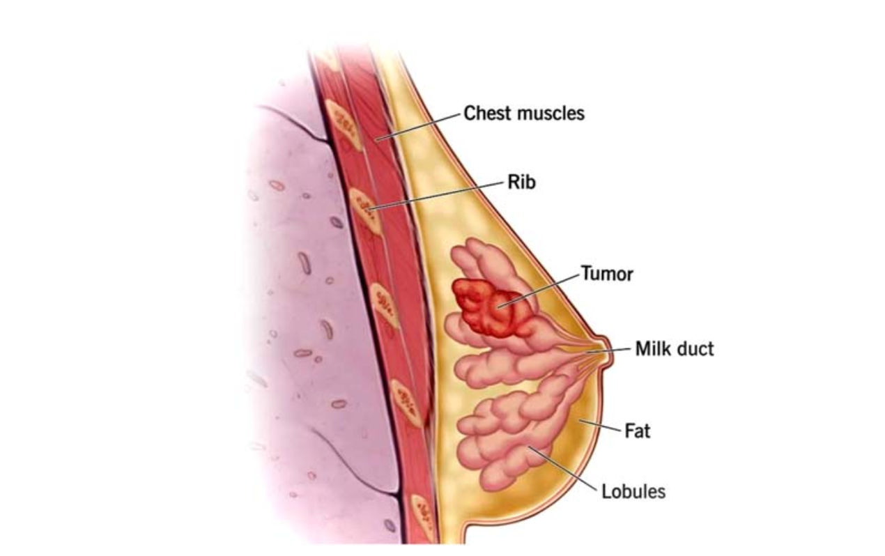

# Scrutinization of Mammogram Images Using Deep Learning 🩺🤖

  

## 📄 Overview
Breast cancer is one of the most common malignancies among women worldwide. Early and accurate detection is critical for effective treatment and minimizing unnecessary procedures.  

This project applies **deep learning models** to **classify breast ultrasound images** as benign or malignant. The work is based on the **BUSI Dataset** and has been published as a **book chapter** in:

> *Computational Intelligence and Modelling Techniques for Disease Detection in Mammogram Images*  
> DOI: [10.1016/B978-0-443-13999-4.00009-2](https://doi.org/10.1016/B978-0-443-13999-4.00009-2)

### 📖 Abstract
Progressive steps were taken by deep learning models, with the **Convolutional Neural Network (CNN)** as the primary method for extracting semantic information from images.  
The study explored multiple imaging modalities including MRIs, CT and PET scans, X-rays, ultrasounds, fluorescein angiography, and photographs.  
The dataset contained **13120 images** of benign and malignant cases. Models implemented include **AlexNet, ResNet50, DenseNet201, and VGG16**, as well as a **Base CNN model with data augmentation**, which achieved the best accuracy.  
This work demonstrates how deep learning can **accurately detect breast cancer**, helping reduce false negatives and unnecessary treatments.

---

## 🧰 Technologies Used
- **Languages:** Python  
- **Libraries & Tools:** TensorFlow, Keras, PyTorch, NumPy, Pandas, Matplotlib, Seaborn  
- **Deep Learning Models:** AlexNet, ResNet50, DenseNet201, VGG16, Base CNN with Keras Tuner and augmentation  
- **Other:** Jupyter Notebook, Data Augmentation Techniques

---

## 🗂️ Dataset
- **Source:** Breast Ultrasound Images (BUSI) Dataset by Dr. Aly Fahmy et al.  
- **Description:** 13120 images containing benign and malignant cases  
- **Goal:** Classify breast lesions accurately to aid early diagnosis  

---

## 🚀 Workflow
1. **Data Preprocessing:** Resized images, normalized pixel values, applied data augmentation  
2. **Model Building:** Implemented CNN architectures with and without transfer learning  
3. **Training & Validation:** Trained models and validated using separate testing data  
4. **Evaluation:** Measured Accuracy, F1 Score, Precision, and Recall for all models  
5. **Visualization:** Plotted confusion matrices, accuracy curves, and sample predictions

---

## 📊 Key Results
| Model                                   | Accuracy | Notes |
|----------------------------------------|---------|-------|
| AlexNet                                 | 80%     | Moderate performance, affected by testing variations |
| ResNet50                                | 77%     | Precision and recall impacted by dataset characteristics |
| DenseNet201                              | 75%     | Slightly lower than other pretrained models |
| VGG16                                   | 73%     | Limited by architecture |
| Base CNN + Keras Tuner + Augmentation   | 88%     | Best performing model; augmentation improved results |

💡 **Insights:**  
- Base CNN with augmentation outperformed pretrained architectures.  
- Data augmentation and hyperparameter tuning were critical for improved performance.

---

## 🔗 Published Book Chapter
**Title:** Scrutinization of Mammogram Images Using Deep Learning  
**Book:** Computational Intelligence and Modelling Techniques for Disease Detection in Mammogram Images  
**Publisher:** Elsevier  
**Year:** 2025  
**DOI:** [10.1016/B978-0-443-13999-4.00009-2](https://doi.org/10.1016/B978-0-443-13999-4.00009-2)

- Citation:
`Thotakura, Tulasi. "Scrutinization of Mammogram Images Using Deep Learning." 
In Computational Intelligence and Modelling Techniques for Disease Detection in Mammogram Images, 
Elsevier, 2025. DOI: 10.1016/B978-0-443-13999-4.00009-2.`

This book chapter explores the application of **deep learning techniques**—specifically CNN-based architectures such as **ResNet50, DenseNet201, AlexNet, and VGG16**—for the **accurate detection of breast cancer** from mammogram images.

